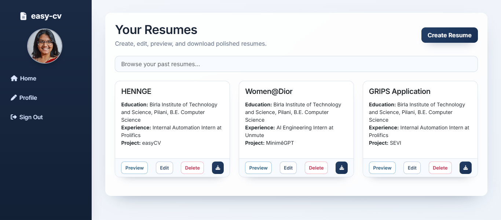

<h1 align="center"> EasyCV </h1>

<p align="center"> A quick resume modifier to tailor your resume appropriately within minutes. </p>


<h3> TLDR; What is <b>EasyCV</b>?</h3>
<ul>
  <li>Automation tool for quickly building tailor-made resumes for applying to different domains or roles</li>
  <li>Maintains complete database of profile and dynamically generates resume based on user's selections</li>
  <li>Has a user authentication system, keeps records of all resumes made in the past and allows for browsing</li>
</ul>

### Why'd I build it?
<p align="justify"> 
  I was applying to a whole lot of internships and entry-level jobs, and I had no idea what kind of work I wanted to do. I knew to list my strengths and weakness pretty well in interviews, but I simply wasn't able to even <em>make</em> it to an interview because my resume wasn't going through. I even understood why that was the case; I'd send the same resume to everyone and I tried to make it as generalized as possible, hoping that the recruiter for the UI/UX role I applied to doesn't realise that I sent the same CV to a data science position. And of course, it made sense that I wasn't getting any calls for an interview.
  
  But as much as I was sick of this, and as much as I realized what the problem was, I also had another problem that I still haven't been able to overcome; laziness. Like, I'll work <em>extremely</em> hard on something that I'm interested in, and I'll do it <em>only</em> if I'm interested in it. And, constantly changing my CV for every job that looked attractive to me was absolutely not it. I desperately wished there was a site that would do this for me, for free, of course. Spoiler alert: there wasn't.
  
  So I just built it myself. Yup, instead of just making some 3 different resumes meant for different roles, I just <em>had</em> to build an application that did it for me.
</p>

### Here's what it looks like!



### How to run it?

1. Clone the repo, download it, do whatever you'd like to set it up in your code editor.

    ```bash
    git clone https://github.com/vennby/easy-cv.git
    cd easy-cv
    ```

2. Create a `.env` file and add the following in it, to make it run for now.

    ```bash
    PROD_KEY="your_prod_key_here_literally_doesn't_matter_what_you_write"
    DATABASE_URL="sqlite:///database.db"
    GOOGLE_CLIENT_ID="your_google_oauth_client_id"
    GOOGLE_CLIENT_SECRET="your_google_oauth_client_secret"
    GOOGLE_REDIRECT_URI="http://127.0.0.1:5000/google-authorize"
    ```

  If you don't want Google login yet, you can leave the `GOOGLE_CLIENT_ID` and `GOOGLE_CLIENT_SECRET` values empty.

  In Google Cloud Console, add this authorized redirect URI for local development:

  ```
  http://127.0.0.1:5000/google-authorize
  ```

3. Then, simply run this to first install the necessary libraries all at once.

    ```bash
    pip install -r requirements.txt
    ```

4. Since this is a Flask application, this command should do the job.

    ```bash
    flask run
    ```
